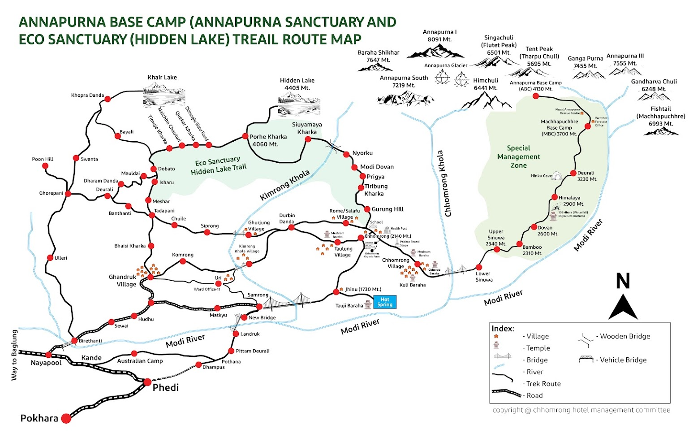
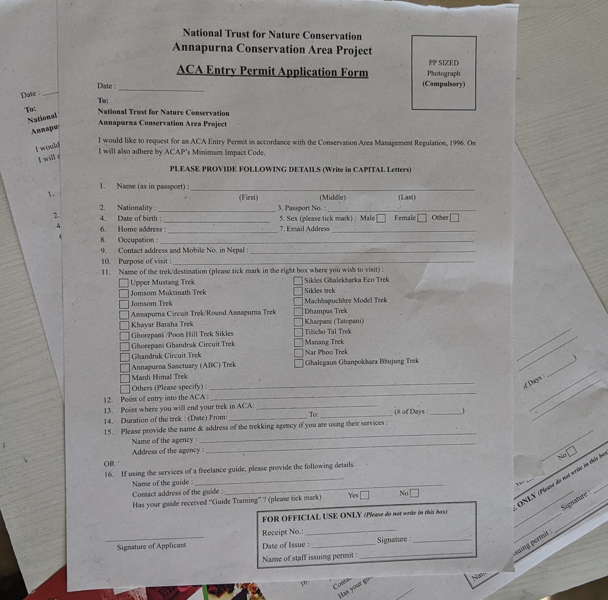
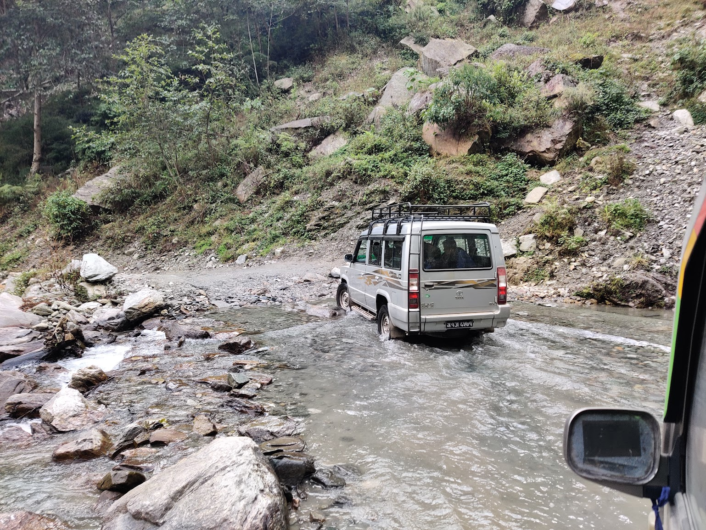
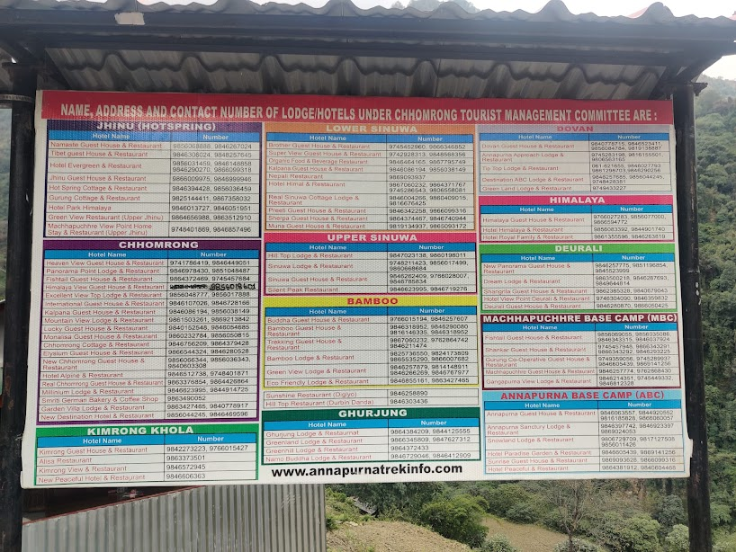
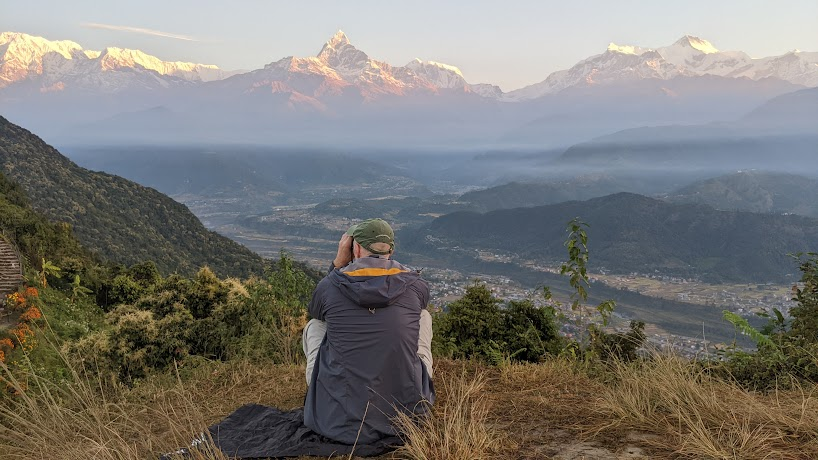

Embarking on a self-guided trek with friends in the Annapurna region is more than a journey; it's a personal odyssey filled with shared moments and breathtaking landscapes. In this blog post, I'll share my personal motivations for choosing this unique adventure, guide you through practical aspects such as arranging transportation to Pokhara and acquiring permits independently, provide a cost breakdown, and ensure a safe and memorable trekking experience.

## Overview

- [Trekking in Nepal](#trekking-in-nepal)
- [Current Possibility](#current-possibilities)
- [Planning out transportations](#planning-out-transportations)
- [Arranging permit acquisition](#arraning-permit-acquisition)
- [Organizing the Trekking Route and Securing Guest House Accommodations](#organizing-the-trekking-route-and-securing-guest-house-accommodations)
- [Cost Breakdown](#cost-breakdown)
- [A recommended activity in Pokhara apart from trekking](#a-recommended-activity-in-pokhara-apart-from-trekking)

### Trekking in Nepal

Nepal, cradled in the embrace of the Himalayas, stands as a trekking haven, seamlessly blending awe-inspiring landscapes with profound cultural immersion. The trails wind through living histories, guiding trekkers through ancient villages and diverse communities. From the lush terraced fields to the serene alpine meadows, Nepal's vistas etch an indelible mark on the soul. Beyond being a mere physical endeavor, trekking in Nepal unfolds as a spiritual journey, with fluttering prayer flags and ancient monasteries creating an ethereal ambiance. The allure of Nepal's trekking extends across all levels, offering challenges like the iconic Everest Base Camp and cultural odysseys through Annapurna, catering to diverse aspirations.

Adding to the allure is Nepal's extensive trail network, featuring renowned routes like the Everest Base Camp and the Annapurna Circuit, alongside hidden gems like the Langtang Valley or Upper Mustang. Within the Annapurna region, a myriad of trails beckons exploration, each presenting a unique charm, from the celebrated Annapurna Sanctuary to the captivating Poon Hill trek, where panoramic sunrise views unfold. Well-maintained paths, teahouse accommodations, and the warm hospitality of local communities along the way ensure that Nepal's trails provide an immersive experience of the unparalleled beauty of the Himalayas.

### Current Possibilities

As enthusiasts of independent trekking, navigating the array of trekking options reveals a unique opportunity for those seeking a journey without the aid of a travel agency, guide, or porter. While some trails necessitate a guide, a discovery within this landscape perfectly aligns with the preference for autonomy and our limited timeframe—the Annapurna Base Camp (ABC) trek.

In the sphere of independent trekking, the freedom to set one's own pace and immerse in the surroundings is essential. Not all routes provide this flexibility, as some mandate a guide. Focused on self-sufficiency and constrained by a 5-day window, the ABC trek emerges as an ideal choice.

Embarking on this journey from the lively town of Pokhara to the heights of Annapurna Base Camp, the allure lies in the liberty to shape our adventure. Here, every step becomes a testament to the grandeur of the Himalayas—an exploration where the landscape unfolds without constraints.

Inspired by the supportive community in a dedicated Facebook group named [Backpackers and travelers in Nepal](https://www.facebook.com/groups/2282827915351254/?hoisted_section_header_type=recently_seen&multi_permalinks=3265005573800145), where members shared invaluable experiences, we found encouragement to opt for an independent Annapurna Base Camp (ABC) trek. This online space proved to be a goldmine of up-to-date information and practical tips, enhancing our confidence for the journey.

Additionally, we conducted thorough research on [the official ABC trek website](https://annapurnatrekinfo.com/), which provided essential details on permits, trail conditions, and gear. The combined insights from the Facebook group and the official website shaped our decision, fostering a sense of community-driven exploration backed by reliable resources.

### Planning out transportations

The journey to the Annapurna region began with the decision on how to reach Pokhara, the gateway to our trekking adventure. Here are some options:

- Air Travel: Opting for a domestic flight from Kathmandu to Pokhara not only provided a time-efficient option but also treated us to awe-inspiring aerial views of the Himalayas, setting the tone for the grandeur that awaited us.
- Tourist Bus: Alternatively, another popular mode of transport to reach Pokhara is by tourist bus. This choice offers a more scenic and leisurely journey overland. Travelling by bus allows you to witness the diverse landscapes of Nepal, passing through charming villages, lush valleys, and terraced fields along the way. While the bus ride might take longer compared to a flight, it provides an opportunity to immerse yourself in the local culture and enjoy the picturesque beauty of the countryside. Additionally, the journey by bus can be a more cost-effective option for budget-conscious travellers, offering a balance between affordability and a unique travel experience.

Once in Pokhara, determining how to get to the trekking starting point became our next consideration. We discovered a convenient option through [Ghandruk Jeep Station](https://maps.app.goo.gl/pgvuqQdKZpz8znKj9), which offered a reliable one-way service to Jhinu Bridge at a cost of NPR 7500. Being picked up directly from our hotel in the Lakeside area of Pokhara added to the efficiency and convenience, making the overall cost and logistics favourable for our group of three. For solo travellers or those seeking a more economical option, commuting to the jeep station and sharing the ride with fellow trekkers can be a cost-effective alternative, with the total fare divided among passengers, usually accommodating 6–7 individuals. The choice between these transportation options depends on personal preferences, group size, and budget considerations, ensuring a seamless transition from Pokhara to the starting point of our trek.

### Getting Permits

Taking charge of our trek meant acquiring permits independently, a process that added a sense of responsibility and connection to the journey.

- ACAP (Annapurna Conservation Area Permit): Obtaining the Annapurna Conservation Area Permit (ACAP) turned out to be a straightforward process, highlighting the ease of managing it independently. A visit to the ACAP counter in Pokhara required little more than passport-sized photos, a filled-out form, your original passport, and NPR 3,000. This tangible commitment to preserving the natural beauty that surrounded us felt like a crucial step in our journey. The permit, adorned with the names of our group, symbolized our entry into a realm of both adventure and responsibility.

The process, which took less than 30 minutes, was hassle-free, and having a pen on hand to fill out the form ensured efficiency. During our visit to the [ACAP office](https://maps.app.goo.gl/rnVm7n1ozbeEjtJi7), we inquired about additional permits. The officers clarified that for our independent trek, only the ACAP was necessary. Moreover, given our decision to trek without a guide, we were informed that certain sections of the form could be left blank, streamlining the process even further. This experience exemplified the accessibility and simplicity of securing permits for an independent trek, allowing us to embark on our journey with both confidence and a heightened sense of connection to the responsibility of trekking in this beautiful region.

### Organizing the Trekking Route and Securing Guest House Accommodations

Embarking on a comprehensive trekking route, we strategically planned our journey, considering acclimatization and our limited timeframe. Our physically prepared state allowed us to decide a route that maximized our time amidst diverse landscapes, ensuring an immersive experience.

- Day 1: Jhinu Bridge to Chomrong (elevation of 1730m to 2140m): Our trek began with a Jeep ride from Pokhara to Jhinu Bridge. Starting our ascent to Chomrong at 1730 meters and reaching 2140 meters, this initial day provided a gradual acclimatization. We secured accommodations at a picturesque guest house in Chomrong.
- Day 2: Chomrong to Deurali (elevation of 2140m to 3230m): The second day's journey to Deruali, at an elevation of 3230 meters, showcased stunning views and diverse scenery. Our night's stay at Deruali prepared us for the higher altitudes ahead.
- Day 3: Deurali to Annapurna Base Camp (elevation of 3230m to 4130m): Continuing to Annapurna Base Camp at 4130 meters, we experienced the grandeur of the Himalayas. The night at ABC provided a memorable culmination to the day.
- Day 4: Annapurna Base Camp to Bamboo (elevation of 4130m to 2310m): Witnessing the breathtaking sunrise at ABC, we descended to Bamboo at 2310 meters. Diverse scenery accompanied our hike, offering a unique perspective on the landscape.
- Day 5: Bamboo to Jhinu Bridge, then drive to Pokhara (elevation of 2310m to 1730m): The final leg took us back to Jhinu Bridge from Bamboo, concluding our trek. A Jeep ride then transported us back to Pokhara, ensuring a seamless end to our adventure.

In anticipation of high-season demand, particularly from travel agencies with large groups, securing guest house accommodations became a priority. To address this, we proactively contacted guest houses listed in our route (as captured in pictures) well in advance. This precautionary measure ensured confirmed accommodations at each destination, offering peace of mind and a comfortable resting place after each day's trek. This proactive approach allowed us to fully enjoy the trek without concerns about availability during peak periods, contributing to a seamless and enjoyable experience.

Additionally, Crucial to our trekking preparations was ensuring adequate insurance coverage. Recognizing the unpredictable nature of mountain environments, we obtained comprehensive travel insurance that covered medical emergencies, evacuation, and unforeseen circumstances. This precautionary step provided us with a sense of security and allowed us to focus on the adventure, knowing that we were prepared for any unexpected challenges that might arise during our trek.

### Cost Breakdown

| Cost Estimation Per Person   | Amount in NPR | Amount in USD |
| ---------------------------- | ------------- | ------------- |
| Permit for ABC               | 3,000.00      | 22.53         |
| Bus to Pokhara               | 1,700.00      | 12.77         |
| Transport to Jhinu Bridge    | 2,500.00      | 18.78         |
| Transport Jeep to Pokhara    | 2,500.00      | 18.78         |
| Night 1 Spending at Chomrong | 1,903.33      | 14.29         |
| Night 2 Spending at Deurali  | 2,380.00      | 17.87         |
| Night 3 Spending at ABC      | 3,833.33      | 28.81         |
| Night 4 Spedning at Bamboo   | 1,483.33      | 11.14         |
| Other Spending               | 1,190.00      | 8.94          |
| Flight Back to Kathmandu     | 12,670.00     | 95.16         |
| TOTAL Per Person             | 33,160.00     | 249.04        |

In breaking down the estimated costs for an individual embarking on the Annapurna Base Camp trek, several factors were considered to provide a comprehensive budget. The Annapurna Conservation Area Permit (ACAP), a fundamental requirement for the journey, amounted to 3,000 NPR or 22.53 USD per person. Transport expenses, including the bus journey from Kathmandu to Pokhara, transportation to Jhinu Bridge (the trek's starting point), and a Jeep ride back to Pokhara, were divided among individuals, each contributing 12.77 USD, 18.78 USD, and 18.78 USD, respectively. Accommodation costs for each night (including place to stay, dinner and breakfast distributed as 14.29 USD for Chomrong, 17.87 USD for Deurali, 28.81 USD for Annapurna Base Camp, and 11.14 USD for Bamboo, ensured comfortable rest along the trek. Additional spending, accounting for coffee/tea during breaks of trekking, amounted to 8.94 USD per person. The flight back from Pokhara to Kathmandu contributed 95.16 USD to the individual's budget. Consequently, the total estimated cost per person for this transformative trekking adventure stands at 249.04 USD, providing a detailed breakdown for prospective trekkers to plan their financial considerations meticulously.

### A recommended activity in Pokhara apart from trekking

For those with limited time or a preference for activities other than trekking, Pokhara offers a myriad of diverse attractions that showcase the region's natural beauty and cultural richness. The city is renowned for its serene lakes, with Phewa Lake being a central hub for boating and relaxation. Additionally, the International Mountain Museum provides insight into the rich mountaineering history of the region. For a touch of spirituality, the Peace Pagoda offers panoramic views of the Annapurna range and the city below. Another highlight is the fascinating Gupteshwor Cave, known for its intricate rock formations and a hidden waterfall.

One highly recommended activity in Pokhara, especially for those pressed for time, is catching the sunrise at Sarangkot Viewpoint with the Cable Car. This experience is a must-do because the panoramic views of the Annapurna and Dhaulagiri mountain ranges during sunrise are nothing short of breathtaking. The changing hues of the sky, coupled with the silhouette of the majestic mountains, create a surreal and awe-inspiring spectacle. It's a moment that captures the essence of the Himalayan beauty in its purest form, making it a cherished memory for any visitor.

Embarking on a self-guided trek with friends in the Annapurna region was not just an adventure; it was a personal odyssey defined by shared experiences, breathtaking landscapes, and careful preparation. As you prepare for your own trekking adventure, may it be filled with the same sense of exploration, camaraderie, and personal discovery that defined our unforgettable odyssey in the heart of the Himalayas.

Additionally, crucial to our trekking preparations was ensuring adequate insurance coverage. Recognizing the unpredictable nature of mountain environments, we obtained comprehensive travel insurance that covered medical emergencies, evacuation, and unforeseen circumstances. This precautionary step provided us with a sense of security and allowed us to focus on the adventure, knowing that we were prepared for any unexpected challenges that might arise during our trek.

In closing, we hope your journey, like ours, is marked by awe-inspiring moments, cultural immersion, and the joy of conquering the magnificent Annapurna trails. Happy trekking!

#### Additional Resources

- Facebook Group: [Backpackers and travelers in Nepal](https://www.facebook.com/groups/2282827915351254/?hoisted_section_header_type=recently_seen&multi_permalinks=3265005573800145)
- Transportation from Pokhara to Starting Point: [Ghandruk Jeep Station](https://maps.app.goo.gl/pgvuqQdKZpz8znKj9) Phone Number: +9779856010928
- Issuing Trekking Permit: [ACAP Entry Permit Counter-Pokhara](https://maps.app.goo.gl/rnVm7n1ozbeEjtJi7)