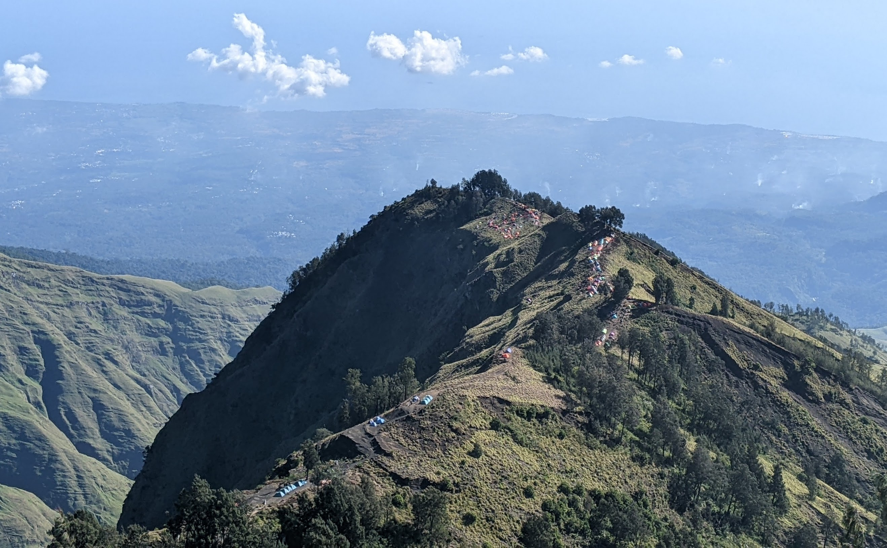
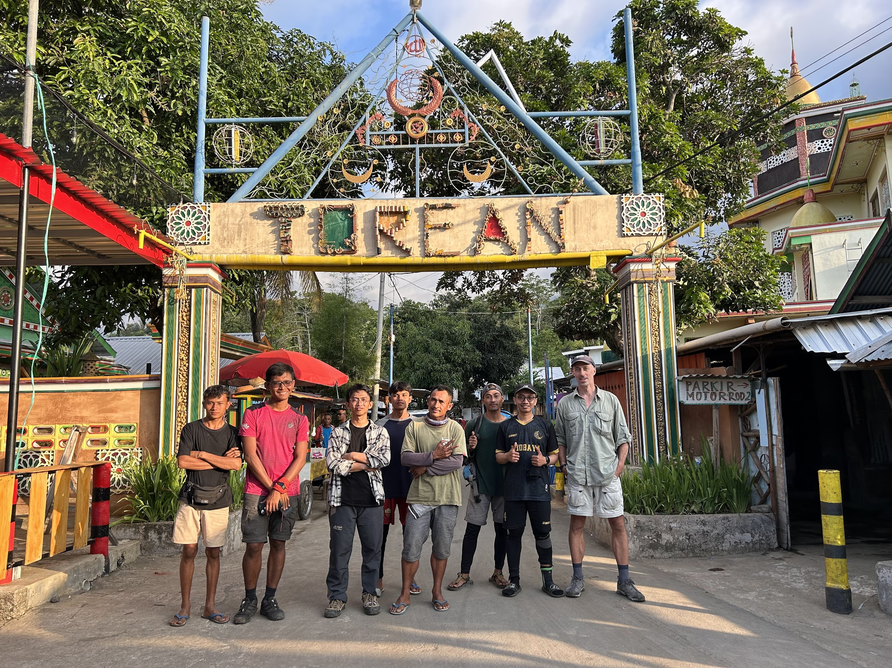
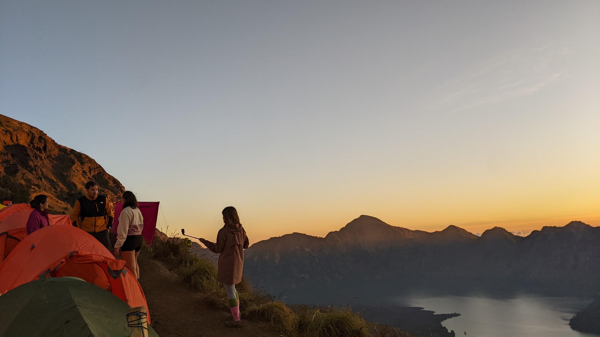
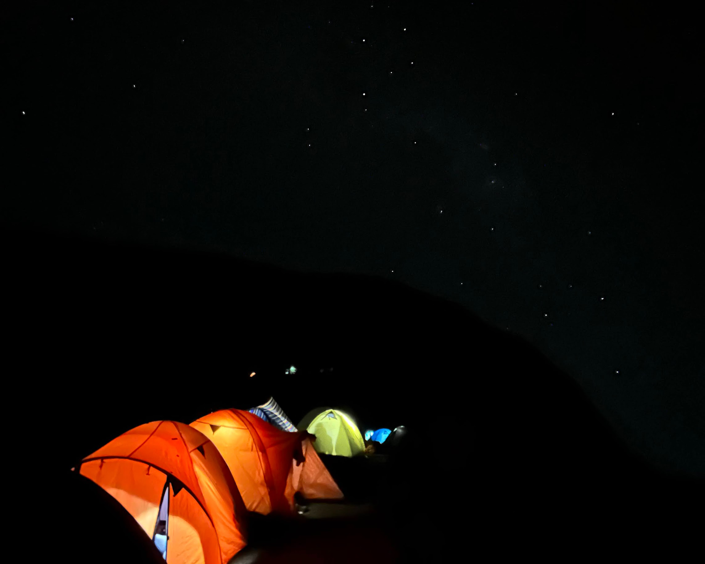
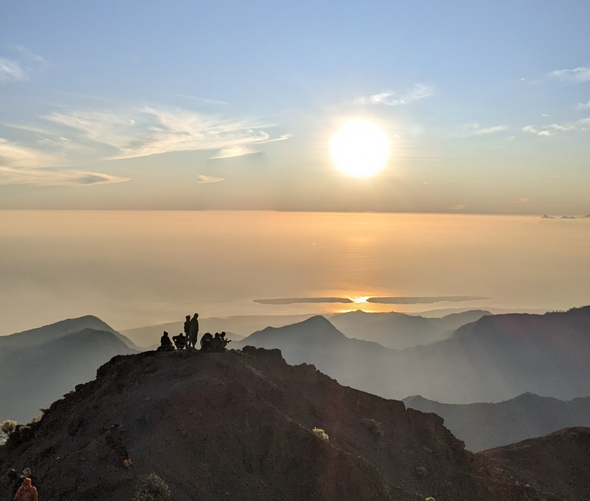
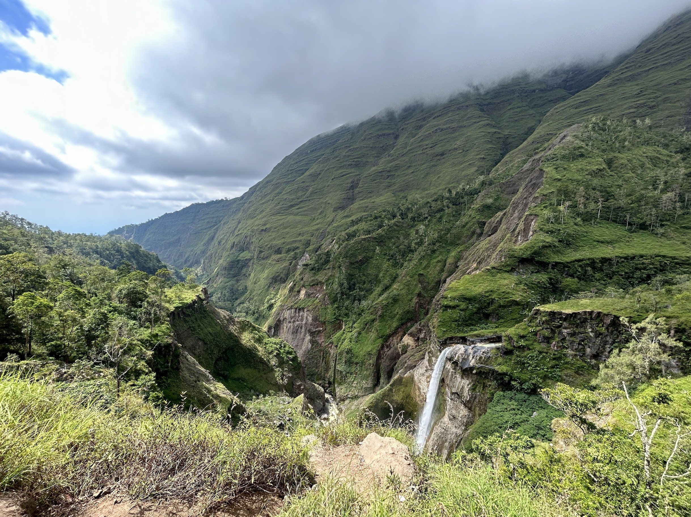
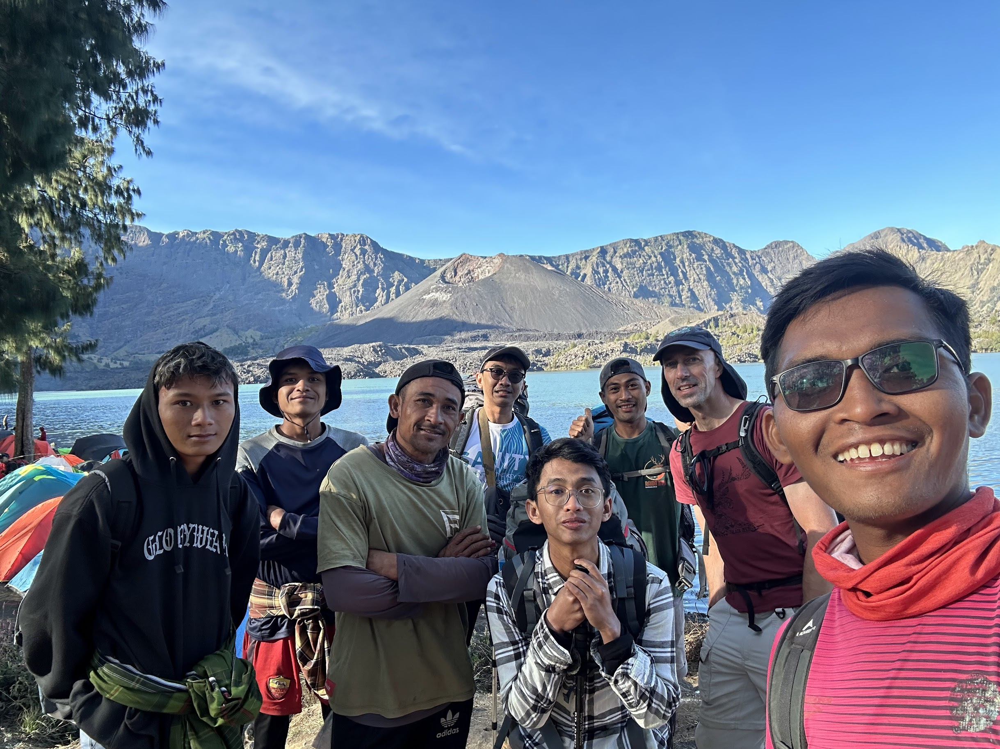

<small>This blog post was originally posted for [Packing Panic](https://packingpanic.com) and [can be accessed here](https://blog.packingpanic.com/posts/rinjani/).</small>

Several times I had plans to experience the thrill of conquering the second highest mountain in Indonesia, and finally, after previous failed attempts, in the second week of July 2023, I had the opportunity to enjoy the beauty of Mount Rinjani in West Nusa Tenggara Province, Indonesia, with my friends.

In this post, I will share my personal preparations before embarking on the hike, information about the journey to Lombok, my experience with registration and collaboration with local guides and porters, profound impressions during the ascent, and other alternative tourist spots to visit while in Lombok.

My enthusiasm to narrate this story filled with beauty, challenges, and natural wonders. Let's begin exploring this exciting journey together!

## Overview

- [Preparations for the Adventure: Physical Readiness and Experienced Guidance](#preparations-for-the-adventure-physical-readiness-and-experienced-guidance)
- [Journey to the Ascent](#journey-to-the-ascent)
- [Scenic Route: Sembalun to Torean](#scenic-route-sembalun-to-torean)
- [Camping Under the Starry Night Sky](#camping-under-the-starry-night-sky)
- [Captivating Sunrise Moments and Island Views from the Summit](#captivating-sunrise-moments-and-island-views-from-the-summit)
- [Encountering Waterfalls and Hills Along the Journey](#encountering-waterfalls-and-hills-along-the-journey)
- [Gratitude to Resilient Guides and Porters](#gratitude-to-resilient-guides-and-porters)
- [Cost Estimate and Expenses During the Hiking Trip](#cost-estimate-and-expenses-during-the-hiking-trip)
- [Other Things to See in Lombok](#Other-things-to-see-in-lombok)

### Preparations for the Adventure: Physical Readiness and Experienced Guidance

Physical preparation is one of the main components of this journey, as it will take us to a mountain with an altitude of 3,726 meters above sea level in 3 days and 2 nights. I made sure to have the appropriate fitness level for the challenge. I engaged in accessible physical exercises suitable for my comfort. If you are not accustomed to mountain climbing or intense cardio workouts, start with light physical activities such as walking, cycling, or swimming. Strength training is also crucial to prepare the body for the challenging terrain.

Furthermore, the contribution of [local guides and porters](https://instagram.com/amaqporter) is invaluable for our safety and comfort. They possess extensive knowledge of the terrain, weather, and best routes, which will ensure a smooth and secure journey. Additionally, local guides can share fascinating information and stories about the mountain and its surrounding environment, making the hiking experience more meaningful and memorable. With the assistance of porters, the burden to carry during the hike will be lighter, allowing us to focus on the ascent without unnecessary weight. All of this will create a more enjoyable journey and provide an opportunity to connect with the local community. Collaborating with [local guides and porters](https://instagram.com/amaqporter), our comfort and safety during the hike become their top priorities.

### Journey to the Ascent

Lombok, a gem in the Indonesian archipelago, offers captivating natural beauty and rich culture. Located east of Bali, this island is known for its beautiful beaches, spectacular waterfalls, and challenging mountains. Lombok also presents the charm of traditional villages, friendly locals, and delicious cuisine. For travelers seeking adventure and the tranquility of nature, Lombok is a dream destination not to be missed.

Before embarking on the Rinjani expedition, I spent more than a week exploring the island of Lombok. The journey to the hiking basecamp started from the city of Mataram with a car driven by one of the fellow hikers in our group.

During the journey to Lombok, I crossed via a local boat from Gili Island to Bangsal Harbor and then continued the land journey to various tourist areas in Lombok. Other alternatives to reach Lombok include:

1. Flights: One of the easiest ways to reach Lombok is by direct flights from major cities in Indonesia, such as Jakarta, Surabaya, or Denpasar, Bali. Lombok International Airport (LOP) serves domestic and international flights. For international routes, direct flights to and from Lombok are available from Singapore and Kuala Lumpur.
2. Ferry: Lombok can be accessed via ferry from Bali. This journey is popular due to Lombok's proximity to Bali. You can take a ferry from Padang Bai Harbor in Bali to Lembar Harbor in Lombok.
3. Speedboat: If you prefer a faster journey, you can use speedboat services from Bali to Lombok. Common departure harbors for speedboats are Padang Bai and Sanur.
4. Bus: If you are on the island of Java, you can also use buses to reach Lombok. Buses depart from major cities like Surabaya, Malang, or Yogyakarta to Lembar Harbor in Lombok. The bus journey takes around 12 to 15 hours.

### Scenic Route: Sembalun to Torean

We chose the Sembalun - Torean route for the Rinjani hike because it is said to offer breathtaking scenery. The journey begins from Sembalun, a village located at the foot of Mount Rinjani. While trekking through the Sembalun - Torean route, we were treated to stunning panoramas, such as lush forests and vast savannas. The enchanting natural landscapes made the journey even more impressive and unforgettable.

The Sembalun - Torean route leads us to Plawangan Sembalun, a beautiful spot for camping at an altitude of approximately 2,639 meters above sea level. As we approached Plawangan, we were presented with breathtaking views of Mount Rinjani and the surrounding valley. However, the most spectacular moment arrived at sunset Sembalun - Torean route leads us to Plawangan Sembalun, a beautiful spot for camping at an altitude of approximately 2,639 meters above sea level. As we approached Plawangan, we were presented with breathtaking views of Mount Rinjani and the surrounding valley. However, the most spectacular moment arrived at sunset.

During sunset, the sky transformed into a beautiful gradient of colors, adorning the mountains and valleys with magical hues. The view was mesmerizing and unforgettable, making the camping experience at Plawangan truly special. While enjoying dinner under the starry sky, we could reflect on the wonders of nature so close to us and appreciate the grandeur of Mount Rinjani before our eyes.

### Camping Under the Starry Night Sky

Under the starry sky, the first night of camping at Plawangan offered a captivating view. Looking up, the stars sparkled brightly, creating a mystical atmosphere. It felt humbling to lie beneath the vastness of the universe and feel a deep connection with the cosmos. The sheer number of stars in the night sky was awe-inspiring, and I was amazed by the beauty that surpassed all imagination. Each star seemed to tell its own story, and I got lost in contemplation while following the star patterns above.

As the night deepened, the stars shone even brighter, creating a dazzling backdrop among the dark silhouettes of the surrounding mountains. It was as if the universe was putting on a magnificent sky show just for us. The view was so mesmerizing that I couldn't take my eyes off it, and for a moment, I forgot about the challenges I faced during the ascent. Time seemed to stand still as I immersed myself in the serenity and beauty of the night.

The following night, while camping near Lake Segara Anak, the enchanting starry sky continued to captivate us. The clear sky allowed the stars to shine brightly, reflecting themselves on the calm surface of the lake. It was truly a magical sight, making the camping experience even more unforgettable. Sitting by the lake's edge, mesmerized by the starlight reflecting on the water, created an atmosphere straight out of a dream.

Both nights, under the spellbinding starlight, I was awestruck by the wonders of nature. This breathtaking view added a touch of magic to the adventure, reminding me of the beauty that lies behind the conquered mountains. It was a profound reminder of how small we are in the grand scheme of the universe and how fortunate we are to witness such a mesmerizing celestial performance. The memories of the starry nights at Plawangan and Lake Segara Anak will forever be etched in my heart, serving as a reminder of the boundless beauty that awaits when exploring the heart of nature.

### Captivating Sunrise Moments and Island Views from the Summit

One of the most anticipated moments during this journey was witnessing the sunrise from the summit of Mount Rinjani. As I ascended in the early morning darkness, the first rays of the sun gradually colored the horizon. The sunrise over the clouds, casting golden light across the landscape, was truly magical. This moment will remain etched in my memory forever.

But the enchantment didn't end there. From the summit, I beheld the vastness of the ocean and the surrounding islands, creating a sensation of being on top of the world. The panoramic views of turquoise-colored seawater and lush green islands added to the beauty of the scene. It felt like a stunning blend of earth, sky, and ocean—a view that left me speechless.

### Encountering Waterfalls and Hills Along the Journey

This journey allowed me to discover hidden gems in the form of waterfalls. As I continued the trek on the third day from Lake Segara Anak, the scenery was breathtaking, and the presence of clear and refreshing waterfalls along the trail was a delightful surprise. The flowing waterfalls offered refreshment after the challenging journey, inviting me to take a moment of rest and savor the serenity of nature. My encounters with these waterfalls refreshed my spirit and energized me for the rest of the journey.

Moreover, the hills surrounding the trail were unlike anything I had seen before. They added a sense of adventure and exploration to this journey, enticing me to venture further and discover the beauty of this region. The undulating landscape painted a beautiful picture, and each peak I reached revealed panoramic views of surrounding mountains, valleys, and the glittering Lake Segara Anak below. It was as if the mountains themselves were guiding me on this extraordinary adventure, leading me to hidden treasures that made this trail even more special.

### Gratitude to Resilient Guides and Porters

I am incredibly grateful to Kus, Amaq Febri, Dicky, and Arief, the amazing local guides and porters who made my journey on Mount Rinjani so exceptional. Their invaluable support, vast knowledge, and dedication to preserving the area enriched my experience in every way. From ensuring a safe path to setting up camps and serving delicious meals, their passion for their homeland and responsible trekking practices left a profound impression on me. I proudly support their efforts and recommend contacting them on Instagram at [instagram.com/amaqporter/](https://instagram.com/amaqporter/) for your extraordinary expeditions.

### Cost Estimate and Expenses During the Hiking Trip

I was accompanied by 3 other friends on this hiking trip (1 companion from England and 2 other friends who are from and reside in Lombok).

Our collective agreement was that, although we used the services of a guide and porters, we did not utilize a tour agency. For certain things such as group equipment and food supplies, we prepared them ourselves, although we had the option to seek assistance from the guide/porter team or, if we decided to use a tour agency, they could have provided everything.

Therefore, I will try to break down the cost estimate that I spent individually.

| Items                                                   | Cost        |
| ------------------------------------------------------- | ----------- |
| Rinjani ticket and online transaction fees (3 days)\*   | IDR 27,500    |
| Guide and Porter for 3 Days 2 Nights                    | IDR 800,000   |
| Gasoline costs for private vehicle from Mataram, Lombok | IDR 100,000   |
| Transportation from Base Camp to Sembalun Hiking Gate   | IDR 100,000   |
| Transportation from Torean to Base Camp                 | IDR 62,500    |
| Basecamp Homestay                                       | IDR 100,000   |
| Expenses for Consumption (Food and Drinks)              | IDR 310,156   |
| Group Equipment Rental Fee (Tents, Stoves, etc.)        | IDR 72,500    |
| Pre-hiking health check-up                        | IDR 20,000    |
| Insurance                                               | IDR 10,000    |
| Estimated Total Cost                                    | IDR 1,602,656 |

*) For local hikers, foreigner fee is IDR 150,000/day

### Other Things to See in Lombok

Apart from Mount Rinjani, the island of Lombok unveils a plethora of captivating destinations that are essential to your visit. Kuta Beach Lombok, distinct from its Bali counterpart, presents an alluring exotic beach setting with its soft white sands and calming azure waters. Meanwhile, Tanjung Aan Beach's tranquil allure amidst green hills draws in snorkelers and surfers seeking a haven.

In addition to these wonders, the allure of Lombok extends to the renowned Gili Islands – Trawangan, Air, and Meno – where snorkeling and diving enthusiasts revel in exotic white sands, crystalline waters, and vibrant underwater ecosystems. But there's more to uncover off the beaten path. Embrace the lesser-known Gili Nanggu, Gili Sudak, and Gili Kedis nestled in the Sekotong region, each boasting untouched beaches and serene environments, perfect for intimate getaways.

When you visit Lombok, don't miss the opportunity to explore its captivating natural wonders. Every corner of this island holds stunning beauty, ready to provide unforgettable experiences for travelers. For a truly unique adventure, consider embarking on a motorcycle journey from Kuta to the Sekotong area. Riding through the picturesque landscapes and scenic routes, you'll not only immerse yourself in the island's beauty but also create cherished memories of a remarkable journey that everyone should try.

Thank you for reading my blog about the adventure of conquering Mount Rinjani in Lombok. I hope this information is beneficial for those planning to explore the natural beauty of the island. I have also madethee video series of the journey can be viewed on [instagram.com/packinpanic](https://instagram.com/packinpanic).

Stay tuned for my next blog about my packing preparations for the next adventure. See you soon!