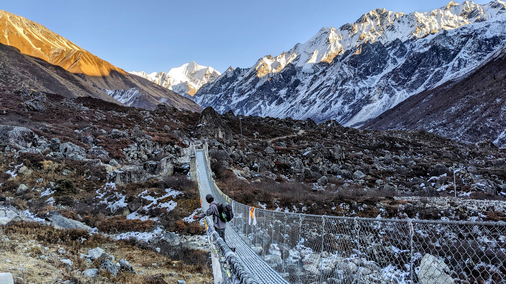
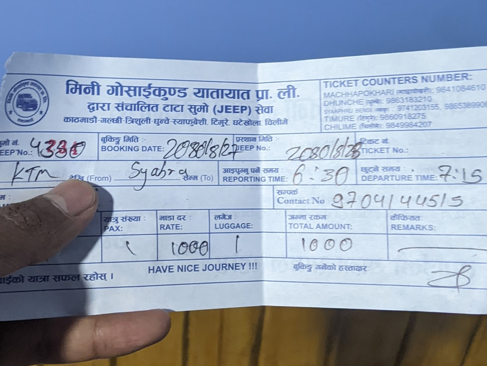
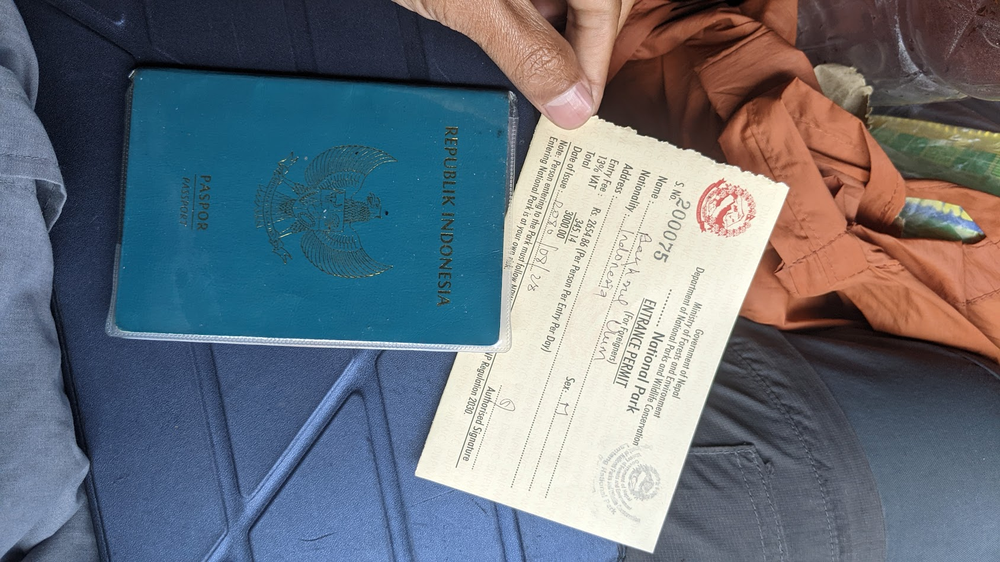
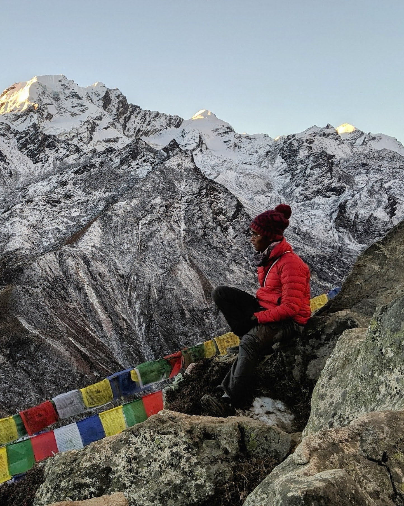

Langtang Trek adalah salah satu perjalanan trekking paling menarik di Nepal yang menawarkan pengalaman mendalam dalam keindahan alam Himalaya, budaya lokal, dan petualangan di pegunungan yang menakjubkan. Langtang Trek terletak di wilayah tengah Himalaya Nepal, di sebelah utara ibu kota Kathmandu. Wilayah ini mencakup Taman Nasional Langtang, yang menjadi rumah bagi berbagai kehidupan liar dan komunitas penduduk setempat.

Secara perjalanan darat dari Ibu kota, Langtang trek terbilang cukup dekat bila dibanding rute trekking lainnya, seperti [Annapurna Base Camp Trek](https://lelunga.id/posts/trekking-independen-ke-annapurna-base-camp/). Apalagi bagi yang tidak punya waktu banyak, Langtang trek terlalu sayang untuk dilewatkan. 

Dalam artikel ini akan dijabarkan beberapa informasi penting yang akan sangat bermanfaat untuk rencana trekking kalian di Langtang.

## Overview

- [Transportasi dan Rute Perjalanan Ke Syabru Besi](#transportasi-dan-rute-perjlanan-ke-syabru-besi)
- [Rute trekking di Lantang National Park)](#rute-trekking-di-langtang-national-park)
- [Estimasi Biaya](#estimasi-biaya)

### Transportasi dan Rute Perjalanan Ke Syabru Besi

Banyak travel agency yang mempunyai jasa untuk sewa guide dan juga porter untuk rute ini. Bagi kalian yang berniat untuk mengatur segala sesuatunya sendiri, artikel ini merupakan guideline tepat untuk kalian.

Umumnya Langtang Trek membutuhkan 4-5 hari atau lebih, tergantung kondisi fisik kalian. Pada petualangan kali ini, seperti yang sudah disebutkan sebelumnya mengenai keterbatasan waktu yang saya punya, saya menyelesaikannya dalan 3 hari saja.

### Hari Pertama menuju Sybaru Besi

Meski ada pilihan Bus dengan jadwal lebih banyak dari [Macha Pokhari, Kathmandu](https://maps.app.goo.gl/4H1JfwLTM3q2vQVd9) untuk menuju titik awal trekking ke Sybaru Besi. Pengalaman pribadi sayy sangat merekomendasikan untuk ikut dalam sharing jeep yang mana tiket konternya tidak jauh dari terminal Bus. Tiket juga bisa dipesan melalui telepon ke nomor +9779841084610. Alasan utama adalah waktu tempuh yang lebih cepat dibanding Bus. Bus juga akan mengambil sebanyak mungkin penumpang sepanjang perjalanan, sehingga mengurangi 
kenyamanan. Biasanya Jeep akan berangkat dari Pukul 07:30 am dan tiba sekitar pukul 14:00 WIB.

### Mendapatkan Tiket Untuk Trekking Di Dunche

Sebelum sampai Syabru Besi, Jeep akan melewati beberapa pos pengecekan militer, yang mana Supir akan meminta passport untuk diperlihatkan. Ini dikarenakan kita akan menuju area perbatasan dengan Tibet.

Satu desa sebelum Syabru Besi adalah Dunche, di mana merupakan gerbang menuju Taman Nasional Langtang. Siapkan passport kalian untuk diperlihatkan dalam pembelian tiket. Petugas sangat ramah menanyakan kemana saja dan berapa lama kita akan di area Taman Nasional. **Harga tiket adalah NPR 3,000**.

## Rute trekking di Lantang National Park

Rute trek Langtang biasanya dimulai dari desa Syabru Besi dan melibatkan perjalanan melalui desa-desa tradisional, hutan pinus, dan lembah yang mengagumkan. Perjalanan ini mencapai ketinggian setinggi lebih dari 4.000 meter.

**Pada hari pertama**, saya memutuskan untuk menginap di **Rimche** sebelum hari terlalu gelap. Desa ini terletak di sepanjang sungai Langtang Khola dan menyuguhkan pemandangan pegunungan yang mulai terlihat. 

**Di hari kedua**, saya memulai perjalanan sangat pagi, karena saya ingin mencapai desa terkahir di jalur trekking bernama **Kyanjin Gompa.** Dari desa ini kalau kalian punya waktu lebih, pertimbangkan untuk menjelajahi jalur dan sudut pandang lainnya. Beberapa pilihan penting termasuk Ganja La Pass, rute yang menantang namun bermanfaat, dan Tserko Ri, yang menawarkan pemandangan panorama Lembah Langtang dan puncak sekitarnya yang menakjubkan.
[!DSC02791~2.jpg](DSC02791~2.jpg]

**Di hari ketiga**, saya memulai trekking sangat pagi, karena berkeinginan untuk menikmati sunrise dari puncak Kyanjin Ri pada ketinggian 4,773 meter di atas permukaan laut.

Setelah puas menikmati keindahan dari atas, saya lantas turun ke penginapan untuk sarapan dan kemudian melanjutkan perjalanan pulang ke Pos awal: **Syabru Besi**. 

Di Syabru besi, saya memutuskan menginal di Hotel untuk kemudian pulang ke Kathmandu di keesokan harinya.

Berikut rincian perjalanan dalam tabel:

| Hari          | Rute                              | Ketinggian                     | Jarak Perjalanan |
| --------------| ---------------------------------| -------------------------------| -----------------|
| Hari Pertama  | Syabru Besi - Rimche              | Start: 1500m Finish: 2450m    | 10Km             |
| Hari Kedua    | Rimche - Kyanjin Gompa            | Start: 2450m Finish: 3870m    | 21Km             |
| Hari Ketiga   | Kyanjin Gompa - Kyanjin Ri - Syabrubesi | Start: 3870m Peak: 4773m Finish: 1500m | 36Km    |

### Estimasi Biaya

| Item                                                      | Jumlah      |
| --------------------------------------------------------- | ----------- |
| Izin Trekking                                              | NPR 3,000   |
| Transportasi Kathmandu - Syabru Besi - Kathmandu           | NPR 2,000   |
| Akomodasi dan Konsumsi Hari Pertama                        | NPR 1,280   |
| Akomodasi dan Konsumsi Hari Kedua                          | NPR 3,080   |
| Akomodasi dan Konsumsi Hari Ketiga                         | NPR 2,900   |

Berdasarkan tabel di atas, biaya total untuk trek Langtangadalah sekitar Rp2.270,000- per orang. Biaya ini dapat bervariasi tergantung pada pilihan akomodasi, makanan, dan kegiatan tambahan yang Anda lakukan selama perjalanan.

### Kesimpulan

Langtang Trek di Nepal, sebagai destinasi solo trekking, telah membuktikan daya tariknya melalui keindahan alam Himalaya, keberagaman budaya, dan petualangan yang intens. Dengan rute yang logistiknya dapat diakses dari Kathmandu, trek ini menjadi opsi menarik, terutama bagi mereka dengan waktu terbatas. Panduan praktis transportasi, rute trekking, dan estimasi biaya memberikan pedoman berharga, sementara pengalaman pribadi penulis menyelesaikan trek dalam 3 hari memberikan inspirasi bagi calon petualang. Dari desa tradisional hingga puncak Kyanjin Ri, Langtang Trek menawarkan pengalaman yang beragam dan tak terlupakan. Dengan interaksi dengan petugas militer di Dunche dan persiapannya untuk perjalanan pulang melalui Syabru Besi, artikel ini memberikan gambaran menyeluruh tentang petualangan solo ini. Dengan menyaksikan sunrise spektakuler dari puncak, Langtang Trek adalah perjalanan yang memberikan kenangan tak tergantikan dari keajaiban pegunungan Nepal.

