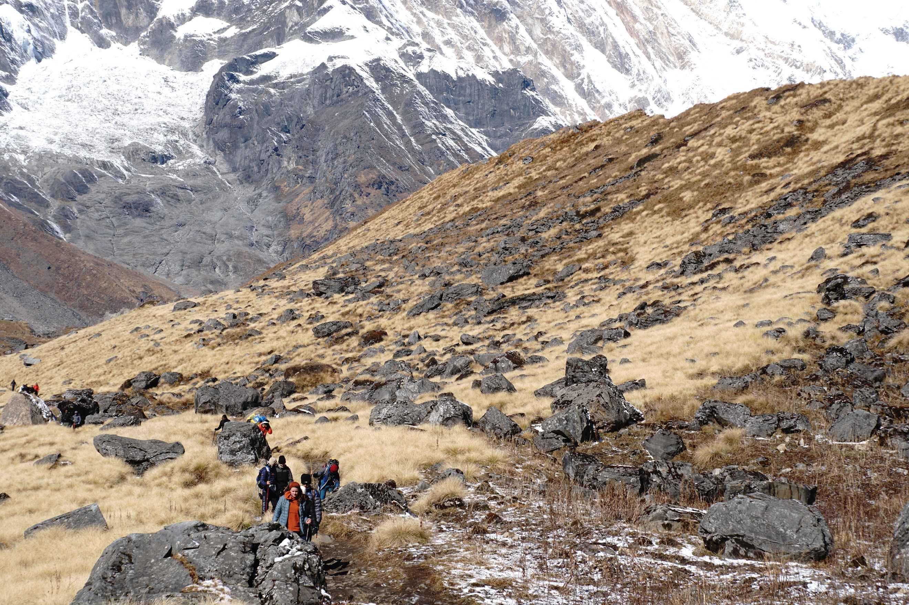

Di samping banyaknya pilihan paket dari Travel Agency baik di dalam dan luar negeri yang menawarkan trekking di Nepal dengan harga yang kompetetif, tapi tak sedikit para pendaki yang memilihi trekking secara Independen. Tidak hanya alasan bisa lebih berhemat dari pada harga yang ditawarkan pada Travel Agensi, tapi juga timeline trekking yang bisa lebih fleksibel sesuai dengan ketersediaan waktu. Banyak juga yang beranggapan bahwa merencakan sendiri memberikan kepuasan lebih dari pengalaman yang dibutuhkan. Bagi kalian yang mempunya rencana untuk trekking di Nepal, artikel ini akan memberikan ulasan komprehensif yang tentunya akan bermanfaat untuk rencana liburan di Nepal dari transportasi, akomodasi dan estimasi budget yang perlu disiapkan.

## Overview

- [Nepal dan Trekking](#nepal-dan-trekking)
- [Memilih Jalur Annapurna Base Camp (ABC)](#memilih-jalur-annapurna-base-camp-(abc))
- [Mengurus Izin Trekking](#mengurus-izin-trekking)
- [Pemilihan Rute Trekking](#pemilihan-rute-trekking)
- [Estimasi Biaya](#estimasi-biaya)

### Nepal dan Trekking

Nepal adalah surga trekking yang menggabungkan pemandangan menakjubkan dengan keberagaman budaya yang mendalam. Jalur trekking membawa kita melintasi sejarah hidup, membimbing melalui desa-desa kuno dan komunitas yang beragam. Dari sawah bertingkat yang hijau hingga padang rumput alpen yang tenang, pemandangan Nepal meninggalkan kesan yang tak terlupakan. Trekking di Nepal bukan sekadar petualangan fisik, melainkan perjalanan spiritual dengan bendera doa berkibar dan candi-candi kumo menciptakan suasana magis. Keindahan trekking di Nepal mencakup semua tingkatan, menawarkan tantangan seperti Everest Base Camp yang ikonis dan petualangan budaya melalui Annapurna, sesuai dengan beragam aspirasi.

Periode terbaik untuk trekking adalah musim gugur (September hingga akhir November) dan musim semi (Februari hingga pertengahan April). Pada saat ini, cuaca stabil dan pemandangan jelas, menciptakan kondisi ideal untuk menjelajahi keindahan alam Nepal. Daya tariknya semakin bertambah dengan jaringan jalur trekking Nepal yang luas, mencakup rute-rute terkenal seperti Everest Base Camp dan Annapurna Circuit, serta tempat-tempat tersembunyi seperti Lembah Langtang atau Upper Mustang. Di wilayah Annapurna, beragam jalur menantang untuk dieksplorasi, masing-masing menawarkan daya tarik unik, mulai dari Sanctuary Annapurna yang terkenal hingga trek Poon Hill yang menakjubkan dengan pemandangan matahari terbit. Jalur-jalur yang terawat dengan baik, akomodasi, dan keramahan hangat masyarakat lokal sepanjang perjalanan memastikan bahwa trekking di Nepal memberikan pengalaman mendalam tentang kecantikan Himalaya yang tak tertandingi.

### Memilih Jalur Annapurna Base Camp (ABC)

Sebagai penggemar trekking mandiri, menjelajahi berbagai pilihan trekking membuka peluang unik bagi mereka yang mencari perjalanan tanpa bantuan agen perjalanan, pemandu, atau porter. Sementara beberapa jalur membutuhkan pemandu, dan hasil riset dan dengan waktu yang dipunya, akhirnya keputusan dipilih adalahi: trek Annapurna Base Camp (ABC). Memulai perjalanan ini dari kota terdekat jalur pendakian yang bernama: Pokhara, yang jaraknya 200 Km dari Ibukota Nepal: Kathmandu.
Berikut beberapa opsi transportasi dari Kathamndu ke Pokhara:

- Penerbangan: Memilih penerbangan domestik dari Kathmandu ke Pokhara tidak hanya memberikan opsi yang efisien waktu tetapi juga memberi kita pemandangan spektakuler Himalaya dari udara, menciptakan suasana kebesaran yang menanti kita.
- Bus Wisata: Sebagai alternatif, moda transportasi populer lainnya untuk mencapai Pokhara adalah dengan bus wisata. Pilihan ini menawarkan perjalanan darat yang lebih indah dan santai. Perjalanan dengan bus memungkinkan kita melihat beragam lanskap Nepal, melewati desa-desa yang menawan, lembah hijau, dan sawah bertingkat sepanjang jalan. Meskipun perjalanan dengan bus mungkin memakan waktu lebih lama dibandingkan penerbangan, ini memberi kesempatan untuk meresapi budaya lokal dan menikmati keindahan pedesaan. Selain itu, perjalanan dengan bus dapat menjadi opsi yang lebih ekonomis bagi pelancong yang berbudget, menawarkan keseimbangan antara keterjangkauan dan pengalaman perjalanan yang unik.

Setibanya di Pokhara, menentukan bagaimana mencapai titik awal trekking menjadi pertimbangan berikutnya. Kami menemukan opsi yang nyaman melalui Ghandruk Jeep Station, yang menawarkan layanan satu arah yang dapat diandalkan ke Jhinu Bridge. Penjemputan langsung dari hotel kami di daerah Lakeside Pokhara menambah efisiensi dan kenyamanan, membuat biaya dan logistik secara keseluruhan menguntungkan untuk kelompok kami yang terdiri dari tiga orang. Bagi solo traveler atau yang mencari opsi lebih ekonomis, pergi ke stasiun jeep dan berbagi perjalanan dengan sesama pendaki bisa menjadi alternatif yang hemat biaya, dengan total biaya dibagi di antara penumpang, biasanya menampung 6–7 orang. Pilihan antara opsi transportasi ini tergantung pada preferensi pribadi, ukuran kelompok, dan pertimbangan anggaran, memastikan transisi lancar dari Pokhara ke titik awal trek kami.

### Mengurus Izin Trekking

Mengurus izin trekking secara mandiri juga memberikan kesan tersendiri, berikut informasi lengkapnya:
- ACAP (Annapurna Conservation Area Permit): Mendapatkan ACAP ternyata adalah proses yang mudah. Kunjungan ke loket ACAP di Pokhara hanya membutuhkan foto berukuran paspor, formulir yang diisi, paspor asli, dan NPR 3.000. 

Prosesnya, yang hanya memakan waktu kurang dari 30 menit, berjalan lancar. Pastikan memawa alat tulis (pulpen) untuk mengisi formulir memastikan efisiensi. Selama kunjungan kami ke kantor ACAP, kami menanyakan tentang izin tambahan. Petugas menjelaskan bahwa untuk trekking mandiri kami, hanya ACAP yang diperlukan. Selain itu, mengingat keputusan kami untuk trekking tanpa pemandu, kami diberitahu bahwa beberapa bagian formulir bisa dikosongkan.

### Pemilihan Rute Trekking

Membuka petualangan di rute trekking yang komprehensif, perjalanan ini direncanakan secara strategis dengan mempertimbangkan aklimatisasi dan batasan waktu yang terbatas. Keadaan fisik yang sudah siap memungkinkan pemilihan rute yang memaksimalkan waktu di tengah lanskap yang beragam, memberikan pengalaman yang mendalam.

- Hari 1: Dari Jhinu Bridge ke Chomrong (ketinggian 1730m hingga 2140m): Perjalanan trek dimulai dengan naik Jeep dari Pokhara ke Jhinu Bridge. Memulai pendakian ke Chomrong dari ketinggian 1730 meter dan mencapai 2140 meter, hari awal ini memberikan aklimatisasi yang bertahap. Akhirnya, berhenti untuk meningap di sebuah guest house yang indah di Chomrong.
- Hari 2: Dari Chomrong ke Deurali (ketinggian 2140m hingga 3230m): Perjalanan hari kedua menuju Deurali, dengan ketinggian 3230 meter, menampilkan pemandangan yang menakjubkan dan lanskap yang beragam. 
- Hari 3: Dari Deurali ke Annapurna Base Camp (ketinggian 3230m hingga 4130m): Melanjutkan perjalanan ke Annapurna Base Camp pada ketinggian 4130 meter.
- Hari 4: Dari Annapurna Base Camp ke Bamboo (ketinggian 4130m hingga 2310m): Menyaksikan matahari terbit yang memukau di ABC, lalu turun ke Pos Bamboo pada ketinggian 2310 meter. Pemandangan yang beragam menyertai pendakian ini menawarkan perspektif unik.
- Hari 5: Dari Bamboo ke Jhinu Bridge, kemudian perjalanan ke Pokhara (ketinggian 2310m hingga 1730m): Bagian terakhir membawa kembali ke Jhinu Bridge dari Bamboo, menyelesaikan trekking. Perjalanan dengan Jeep kemudian membawa kembali ke Pokhara, memastikan akhir petualangan.

Pada sesi ramai, terutama dari agen perjalanan dengan kelompok besar, mendapatkan akomodasi guest house menjadi prioritas. Untuk mengatasi hal ini, persiapkan untuk proaktif menghubungi guest house. Langkah ini memastikan memiliki tempat menginap yang terkonfirmasi di setiap destinasi, memberikan ketenangan dan tempat istirahat yang nyaman setelah trekking sehari-hari. 

### Estimasi Biaya

| Item                                           | Jumlah      |
| ---------------------------------------------- | ----------- |
| Izin Annapurna Conservation Area Permit (ACAP) | Rp350,130   |
| Transportasi dari Kathmandu ke Pokhara         | Rp198,407   |
| Transportasi dari Pokhara ke Jhinu Bridge      | Rp291,775   |
| Transportasi Jeep dari Jhinu Bridge ke Pokhara | Rp291,775   |
| Akomodasi di Chomrong                          | Rp222,099   |
| Akomodasi di Deurali                           | Rp277,770   |
| Akomodasi di Annapurna Base Camp               | Rp447,349   |
| Akomodasi di Bamboo                            | Rp173,081   |
| Pengeluaran lainnya                            | Rp138,885   |
| Penerbangan dari Pokhara ke Kathmandu          | Rp1,478,716 |
| TOTAL                                          | Rp3,869,987 |

Berdasarkan tabel di atas, biaya total untuk mengikuti trek Annapurna Base Camp adalah sekitar Rp3.870,000- per orang. Biaya ini dapat bervariasi tergantung pada pilihan akomodasi, makanan, dan kegiatan tambahan yang Anda lakukan selama perjalanan.

### Kesimpulan

Trekking Annapurna Base Camp (ABC) adalah salah satu trek paling populer di Nepal. Trek ini menawarkan pemandangan yang menakjubkan, budaya yang beragam, dan tantangan yang seimbang.
Bagi mereka yang tertarik untuk melakukan trekking ABC secara mandiri, artikel ini memberikan panduan komprehensif tentang apa yang perlu disiapkan. Artikel ini membahas opsi transportasi, izin trekking, pemilihan rute, dan estimasi biaya.
Berikut adalah beberapa tips tambahan untuk merencanakan trekking ABC secara mandiri:
- Lakukan riset Anda dengan cermat.
- Mulailah merencanakan dengan cukup waktu.
- Bergabunglah dengan grup trekking online.
- Berlatihlah sebelum Anda pergi.
Dengan perencanaan yang cermat dan persiapan yang tepat, Anda dapat menikmati pengalaman trekking ABC yang tak terlupakan.